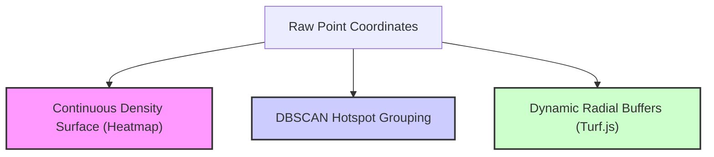
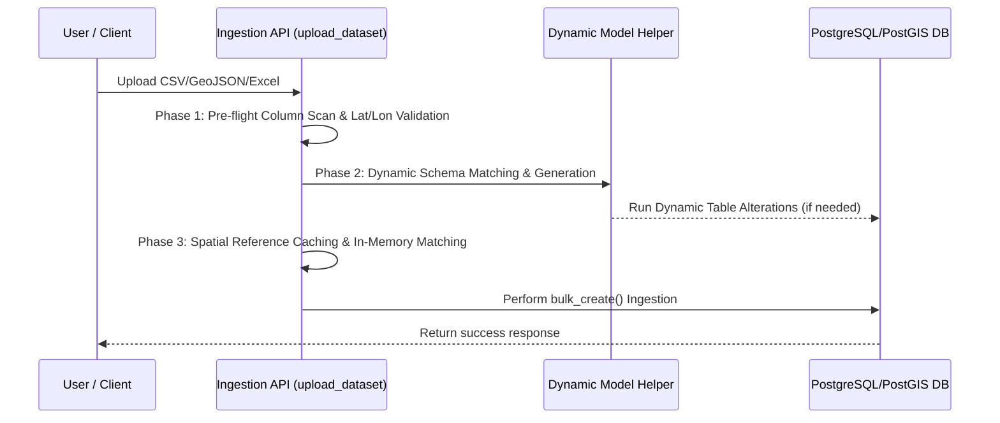

# Methodology & Development Approaches: Infectious Diseases Mapping Project
## A Scientific and Engineering Framework for Spatial Epidemiology

This document outlines the core scientific methodologies, data engineering approaches, and development paradigms implemented to build the **Infectious Diseases Mapping & Analytics System**. 

The architecture is designed to transition epidemiological surveillance from legacy, boundary-constrained polygon aggregations to a modern, point-based continuous spatial paradigm.

---

## 1. Spatial Epidemiology Methodology
Traditional public health mapping aggregates patient occurrences into arbitrary political zones (choropleth maps). This project employs a **Point-Based Continuous Spatial Paradigm** to mitigate the Modifiable Areal Unit Problem (MAUP) and represent outbreak dynamics accurately.

### Approach A: Continuous Kernel Density Estimation (Heatmapping)
Rather than binning cases into static districts, the system visualizes the spatial gradient of transmission through continuous WebGL heatmaps. 
*   **Methodology:** Each point is treated as a continuous probability density distribution over space. The visual overlay sums these overlapping distributions to display a smooth, continuous hotspot gradient.
*   **Scientific Value:** This visualizes outbreaks across administrative borders (e.g., shared water bodies, forest edges), ensuring public health interventions are directed at the actual physical outbreak zones rather than arbitrary political regions.

### Approach B: Circular buffer geoprocessing (Turf.js Pin-Drop)
To obtain reliable density measurements independent of zone geometry, the project implements a circular buffer geoprocessing workflow on the frontend:
*   **Approach:** When a user drops an analytical pin on the viewport, the system generates a mathematically perfect polygon representing a circular boundary of radius $R$ (e.g., 10km) using **Turf.js**.
*   **Calculation:** It filters the spatial FeatureCollection to count all cases falling within this bounding circle:
$$\text{Density} = \frac{\text{Cases}}{\pi R^2}$$
*   **Scientific Value:** This isolates local density measurements, providing an epidemiologically pure baseline that remains completely identical regardless of how provincial or district boundaries are drawn.

### Approach C: PostGIS ST_ClusterDBSCAN Analysis
To identify statistically significant outbreak groupings, the project integrates the **DBSCAN (Density-Based Spatial Clustering of Applications with Noise)** algorithm directly into the database:
*   **Approach:** DBSCAN iterates through coordinate geometries to define clusters based on spatial proximity. Unlike centroid-based algorithms (like K-Means), it does not require a pre-defined number of clusters and can discover clusters of arbitrary shapes (e.g., linear clusters along a river or highway).
*   **Pathogen-Tuned Epsilon:** Epsilon values are mathematically calibrated to represent transmission vectors (e.g., waterborne pathogen vectors require narrow $\approx 1\text{km}$ bounds, whereas vector-borne vectors accommodate broader $\approx 2.8\text{km}$ mosquito flight ranges).

---

## 2. Ingestion & Dynamic Data Engineering
Epidemiological datasets are often unstructured, missing columns, or containing unexpected data fields. To safely handle this without crashing database schemas or requiring frequent migrations, the project uses a **Dynamic Schema-Evolution Ingestion Pipeline**.

### Three-Phase Ingestion Workflow
1.  **Phase 1 (Validation & Pre-flight):** Checks uploaded files for mandatory spatial headers (latitude/longitude) and parses coordinates into standard WGS-84 coordinate points. 
2.  **Phase 2 (Dynamic Schema Evolution):** The system checks for any custom data fields in the upload. It dynamically maps known columns to model attributes and routes extra fields into a high-performance **JSONB** field (`extra_data`) in the database. For dedicated disease models, it uses a dynamic schema manager to automatically adapt backend models to newly introduced criteria without data-destructive schema migrations.
3.  **Phase 3 (Spatial Cache Bulk Loading):** Utilizes Django's `bulk_create` to perform database entries in optimized blocks (default: 500 rows). 

---

## 3. Temporal Epidemiology & Trend Analysis

Outbreaks have distinctive temporal signatures. The methodology behind our temporal engine focuses on separating short-term reporting noise from the underlying epidemiological signals.

### Approach A: ISO-8601 Week Standard (Epi-Weeks)
*   **Approach:** The system aggregates time-series data using standard epidemiological weeks (Monday to Sunday) rather than calendar months. 
*   **Scientific Value:** This ensures that each temporal bin is exactly 7 days long, avoiding the statistical anomalies caused by months having 28, 30, or 31 days and eliminating weekday alignment shifts between different years.

### Approach B: Exponential Moving Average (EMA) Smoothing
*   **Approach:** The system overlays a **4-period Exponential Moving Average** onto raw weekly case counts.
*   **Calculation:**
$$\text{EMA}_t = (Y_t \cdot 0.4) + (\text{EMA}_{t-1} \cdot 0.6)$$
*   **Scientific Value:** This dampens artificial reporting spikes (such as bulk uploads on Mondays after weekend clinic closures) and clearly displays the true transmission trend.

### Approach C: Active-Week Data Truncation
*   **Approach:** In linear regression calculations, the system automatically drops the current calendar week from the regression input.
*   **Scientific Value:** Because reports from the active week are still trickling in, the current week's case counts are almost always lower than completed weeks. Including this incomplete data would artificially drag the trend line downward, creating a dangerous false negative. Truncating the active week keeps the regression output statistically accurate.

---

## 4. Ethical, Privacy, and Clinical Guardrails

Because epidemiological mapping deals with sensitive patient health records, the project integrates strict ethical compliance boundaries directly into its core logic.

### Patient Anonymization
All cases are assigned a cryptographically secure, random **UUID v4** identifier as their primary key. Legacy personal identifiers (names, patient files, IDs) are stripped out during the ingestion phase, ensuring the database is fully anonymized.

### Disease-Specific Privacy Policies
The system implements strict clinical guidelines regarding *what* can be clustered and mapped:
*   **Blocked DBSCAN on HIV**: Distance-based spatial clustering is strictly blocked for contact-borne pathogens (like HIV).
*   **Clinical Rationale:** Spatial point-clustering on HIV cases is mathematically invalid and poses a severe threat to patient privacy, risking social stigmatization or de-anonymization. The system actively blocks DBSCAN requests for HIV cases and prompts users to aggregate data to district levels or utilize venue-based fallen templates.

---

## 5. Performance-First Engineering Paradigms

Handling large spatial datasets on a web platform requires performance-focused optimizations across the stack:

### Approach A: Spatial Generalized Search Tree (GIST) Indexes
By indexing coordinates using GIST, the database can resolve complex boundary-containment and distance calculations in logarithmic time ($O(\log N)$) rather than scanning the entire table ($O(N)$).

### Approach B: In-Memory Spatial Cache
During bulk imports, calculating the nearest health facility for every case coordinate is a computationally expensive operation. Because many cases originate from the same location (e.g., the center of a village), the project implements an in-memory spatial cache (`facility_cache`) in Python:
*   **Methodology:** The system maps coordinate pairs `(longitude, latitude)` to their closest health facility in memory. If a subsequent row has the same coordinates, it retrieves the facility from cache instantly, bypassing the expensive PostGIS distance query.
