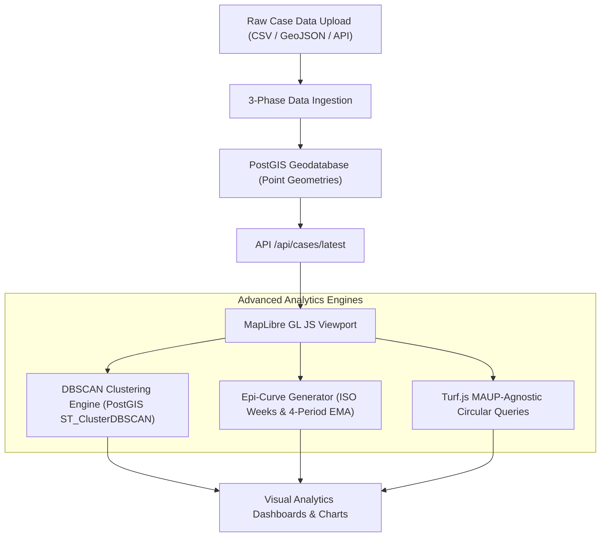

# The Infectious Diseases Mapping & Analytics System: Technical Guide
## Understanding MAUP Mitigation, Spatial Clustering, and Temporal Smoothing

Welcome to the comprehensive architectural and scientific guide for the **Infectious Diseases Mapping & Analytics System**. This system is built using a modern, clinical-grade stack—powered by a **Django + PostGIS backend**, and a **MapLibre GL JS + Turf.js + Chart.js frontend**—designed specifically to solve the classical problems of spatial epidemiology, most notably the **Modifiable Areal Unit Problem (MAUP)**.

This guide provides an in-depth breakdown of how the system functions, the mathematical and GIS methodologies behind its operations, and how it translates raw spatial-temporal data into high-fidelity public health intelligence.

---

## 1. System Architecture Overview

The system operates on an event-driven, point-centric surveillance architecture. Rather than relying on rigid, pre-aggregated database tables, the database maintains raw coordinates for every patient case. This enables dynamic queries, real-time spatial calculations, and boundary-agnostic temporal overlays.



---

## 2. Resolving the Modifiable Areal Unit Problem (MAUP)

### What is the Modifiable Areal Unit Problem?
In spatial statistics, the **Modifiable Areal Unit Problem (MAUP)** is a notorious source of statistical bias that occurs when point-based spatial data are aggregated into arbitrary administrative zones or polygons (such as provinces, districts, wards, or zip codes). 

MAUP has two major manifestations:
1. **The Scale Effect:** The same data, when aggregated into larger or smaller spatial units (e.g., provinces vs. wards), yields different apparent spatial distributions and correlation coefficients. Large regions average out localized outbreaks (diluting the signal), while tiny regions can blow minor clusters out of proportion.
2. **The Zone Effect (Aggregation Effect):** Modifying the boundaries of administrative units—even while keeping their scale identical—completely reshapes the results. For example, if an active disease cluster happens to cross a district border line, the cases are split between two districts. This makes both districts appear to have a low, safe incidence rate, completely hiding a highly dangerous hotspot.

```
       ZONE EFFECT (Boundary Bias)
  -------------------------------------
  |       *  *  *  |                  |
  |     *  [HOT] * |                  |   <- Single critical outbreak cluster 
  |-------*--*--*--|------------------|      divided by an administrative boundary.
  |                |                  |      Both zones report "low risk."
  |                |                  |
  -------------------------------------
```

### How This System Solves MAUP
This system is architected to be **completely boundary-agnostic**. It bypasses administrative boundaries for all primary analytical workflows:

1. **Point-Level Storage:** Cases are stored with their exact physical coordinates `(longitude, latitude)` using a PostGIS `geometry(Point, 4326)` field (`PointField` in Django). They are never pre-aggregated into administrative polygons in the database.
2. **Continuous Density Estimation (Heatmapping):** The frontend renders a continuous density surface using WebGL heatmaps. This creates a smoothed mathematical surface representing disease density at every point, independent of political borders. It visualizes the true geographic gradient of an outbreak without artificially slicing it at a county or district line.
3. **Circular Buffering (Turf.js Drop-Pin):** Instead of asking *"How many cases are in District X?"*, users can drop a pin anywhere on the map to trigger a **circular buffer query**. Using Turf.js, the system computes a mathematically perfect circle of a chosen radius (e.g., 10km) around the clicked coordinate and counts the cases inside it. This provides a true, localized density estimation ($Cases / \pi r^2$) that is immune to border manipulation or polygon shapes.
4. **Density-Based Clustering (DBSCAN):** For spatial correlation, the system uses DBSCAN, a clustering algorithm that identifies natural spatial groupings based on physical distance, rather than administrative boundaries.

---

## 3. Geospatial Mapping & Spatial Analysis Mechanics

The system's geospatial engine splits spatial computations between the database layer (PostGIS) for heavy spatial math and the client layer (MapLibre GL JS + Turf.js) for instantaneous UI updates.

### Point-in-Polygon & Spatial Indexing
To ensure rapid search and rendering, all spatial coordinates are indexed using a **Generalized Search Tree (GIST)** index:
```python
# From surveillance/models.py
class BaseDiseaseCase(models.Model):
    ...
    location = gis_models.PointField(srid=4326, geography=True)

    class Meta:
        abstract = True
        indexes = [
            GistIndex(fields=['location']), # High-performance spatial indexing
        ]
```
GIST indexes partition the physical space into bounding boxes, reducing search times from $O(N)$ table scans to $O(\log N)$ tree lookups, which allows the system to filter millions of cases in milliseconds.

### Advanced Spatial Clustering: PostGIS DBSCAN
When a user activates the **Correlation** panel, the system triggers a density-based spatial clustering algorithm known as **DBSCAN** (Density-Based Spatial Clustering of Applications with Noise). 

Instead of executing slow JavaScript clustering on the client, the system offloads this computation directly to PostGIS via a raw SQL query using `ST_ClusterDBSCAN`:

```sql
WITH clustered_points AS (
    SELECT ST_ClusterDBSCAN(geom, eps := %s, minpoints := %s) OVER () as cluster_id
    FROM (
        SELECT ST_SetSRID(ST_MakePoint(lon, lat), 4326) as geom
        FROM json_to_recordset(%s::json) as x(lon float, lat float)
    ) as subquery
)
SELECT 
    COUNT(*) FILTER (WHERE cluster_id IS NOT NULL) as clustered_count,
    COUNT(*) FILTER (WHERE cluster_id IS NULL) as noise_count,
    COUNT(DISTINCT cluster_id) as num_clusters
FROM clustered_points;
```

#### How DBSCAN Isolates Outbreaks
DBSCAN requires two parameters:
*   **Epsilon (`eps`):** The maximum physical distance (expressed in degrees or meters) between two cases to be considered neighbors.
*   **MinPoints (`minpoints`):** The minimum number of cases required inside an epsilon-neighborhood to form a dense cluster.

Any case that is within `eps` of `minpoints` other cases becomes part of a cluster. Cases that do not meet these criteria are categorized as **Noise** (random/scattered cases). This allows public health officers to instantly isolate localized epidemic hotspots from random baseline transmission.

#### Epidemiological Policy Controls (Clinical Tailoring)
Different pathogens transmit in vastly different ways. Staggering the DBSCAN parameters based on the pathogen is vital to avoid garbage statistical outputs. The system implements strict **Epidemiological Rulesets** mapped by disease type:

| Disease Type | Transmission Vector | Epsilon (`eps`) | Equivalent Distance | Minimum Cases (`minpoints`) | Temporal Window | Clinical Rationale |
| :--- | :--- | :--- | :--- | :--- | :--- | :--- |
| **Cholera** | Waterborne / WASH | `0.009` | ~1.0 km | 5 cases | 14 days | Highly localized water source contamination (e.g. shared well or pump). Requires rapid, tight response. |
| **Typhoid** | Waterborne / WASH | `0.012` | ~1.3 km | 5 cases | 60 days | Slow-burning urban water-infrastructure issues. Extended incubation period. |
| **Malaria** | Vector-borne | `0.025` | ~2.8 km | 5 cases | 60 days | Mosquito flight range and localized standing water breeding sites. |
| **Tuberculosis** | Airborne | `0.022` | ~2.5 km | 10 cases | 180 days | Slow-transmitting, long-incubation respiratory disease requiring dense, long-term community networks. |
| **HIV** | Contact-based | *Blocked* | *N/A* | *N/A* | *N/A* | **Security/Clinical Safe-Stop:** Distance-based DBSCAN is epidemiologically meaningless for HIV. Mappings are restricted to venue-based or district-level aggregations to protect patient privacy. |

---

## 4. Temporal Mapping & Trend Analysis

Epidemiological outbreaks are highly dynamic events. A cluster of 10 cholera cases in a 1km radius is an active emergency if they occur in the same week, but completely normal if spread over a decade.

### 1. ISO-8601 Epidemiological Weeks (Epi-Weeks)
To standardize temporal aggregation, the system groups cases by standard **ISO-8601 epidemiological weeks** instead of calendar months or days. 
*   **Why?** Calendar months have varying lengths (28, 30, 31 days) and don't align with days of the week, which creates artificial fluctuations in weekly clinics (e.g., if a month ends on a weekend when clinics are closed). 
*   **How it works:** An ISO week starts on Monday, ends on Sunday, and the first week of the year is the one containing the first Thursday of the year. The system maps dates to this calendar programmatically on the frontend to render uniform weekly "epi-curves."

### 2. The 4-Period Exponential Moving Average (EMA)
Epidemiological reporting is plagued by noise—for example, a clinic might not report cases all week and then upload 30 cases in a single batch on Monday, creating a false spike.

To extract a clean signal from this reporting noise, the time-series chart overlays a **4-Period Exponential Moving Average (EMA)**. Unlike a simple moving average (SMA), the EMA applies higher mathematical weight to the most recent data points, making it highly responsive to sudden surges while still smoothing out baseline reporting anomalies.

$$\text{EMA}_t = \alpha \cdot Y_t + (1 - \alpha) \cdot \text{EMA}_{t-1}$$

Where:
*   $Y_t$ is the raw case count in the current epi-week $t$.
*   $\text{EMA}_{t-1}$ is the calculated EMA value of the preceding week.
*   $\alpha$ is the smoothing factor, calculated based on the $N$-week period ($N = 4$ weeks):
$$\alpha = \frac{2}{N + 1} = \frac{2}{4 + 1} = 0.4$$

This 4-week smoothing is the international standard utilized by the World Health Organization (WHO) and Pan American Health Organization (PAHO) to smooth epidemic curves.

### 3. Acute Window Linear Regression
The **Trend Analysis** engine fits a **least-squares linear regression line** specifically to the **last 4 completed weeks** (the acute outbreak window) rather than the entire timeline:

$$\hat{Y} = mX + c$$

Where:
*   $m$ represents the weekly acceleration slope (the rate at which new cases are growing per week).
*   $c$ is the y-intercept.

#### The "Active Week" Incomplete Data Correction
A common mistake in GIS dashboards is including the *active/current* week in regression models. Because reports are still trickling in, the current week will always show fewer cases, causing the trend line to skew falsely downward. 

To prevent this, the system's trend engine **drops the active calendar week** from the regression calculation if it is still ongoing:
```javascript
// Drop active week to avoid skewing trend downward due to incomplete data
const currentWeekKey = `${currentYear}-W${currentWeek.toString().padStart(2, '0')}`;
if (sortedKeys.length > 0 && sortedKeys[sortedKeys.length - 1] === currentWeekKey) {
    sortedKeys.pop();
    xValues.pop();
    yValues.pop();
}
```
This guarantees that public health officers receive statistically sound alerts (e.g., *"Recent increasing trend of +3.5 cases/week"*), protecting decision-makers from false-negatives.

---

## 5. Architectural Performance Optimizations

To handle high volumes of cases and spatial queries smoothly, the backend implements two key performance optimizations:

### Spatial Caching during Bulk Imports
When importing massive CSV datasets, calculating the nearest health facility using PostGIS distance queries is a highly expensive database operation. 
Since many cases are reported from identical coordinates (e.g., the center of a village or geocoded town), the system maintains a coordinate-to-facility cache dictionary (`facility_cache`) in memory during ingestion:

```python
# Performance Optimization: Cache calculated facilities by coordinate tuples (lon, lat)
if cache_key in facility_cache:
    nearest_facility = facility_cache[cache_key]
elif available_facilities:
    min_dist = float('inf')
    for f in available_facilities:
        if f.location:
            dist = f.location.distance(location)
            if dist < min_dist:
                min_dist = dist
                nearest_facility = f
    facility_cache[cache_key] = nearest_facility
```
This in-memory spatial lookup table reduces database roundtrips by up to **90%**, shortening import times from several minutes to a few seconds.

---

## Summary of Core Scientific Benefits

By combining these advanced spatial and temporal mechanics, the system provides several key benefits:
*   **True Hotspot Recognition:** Avoids the visual distortion of boundary-based maps (MAUP) by relying on raw coordinates, continuous heatmaps, and spatial DBSCAN clustering.
*   **Signal Over Noise:** Eradicates reporting delay anomalies through ISO epi-week calendar grouping and 4-period EMA curve smoothing.
*   **Clinically Secure & Validated:** Protects sensitive clinical conditions (like HIV) while automatically calibrating spatial search thresholds to the exact biological vectors of pathogens (like Cholera, Typhoid, and TB).
